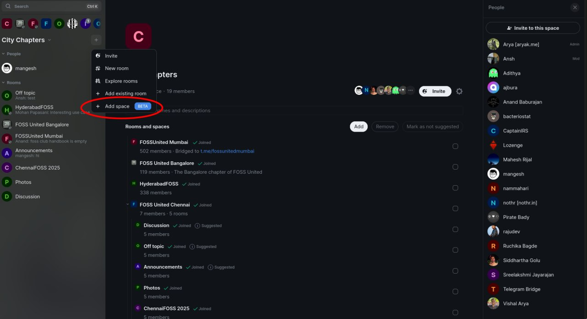
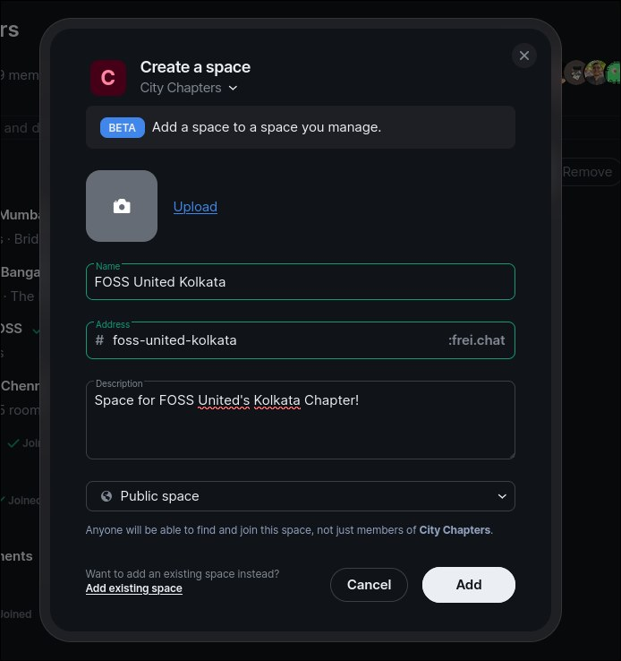
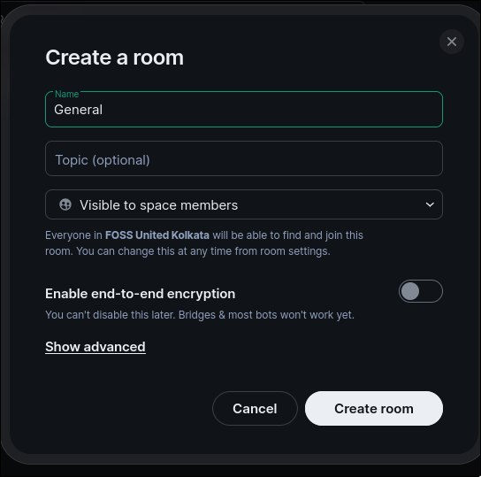
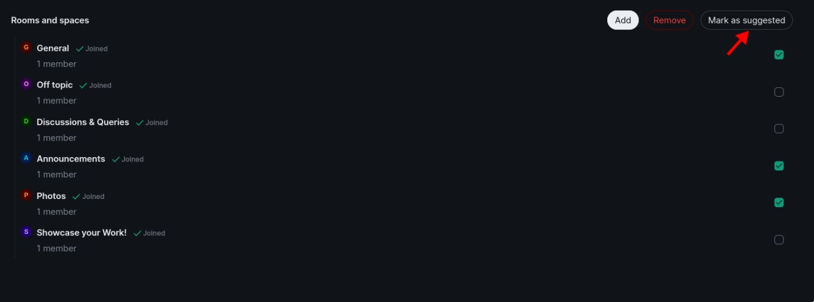
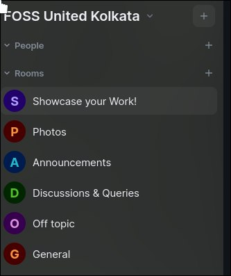
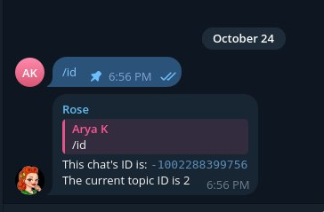
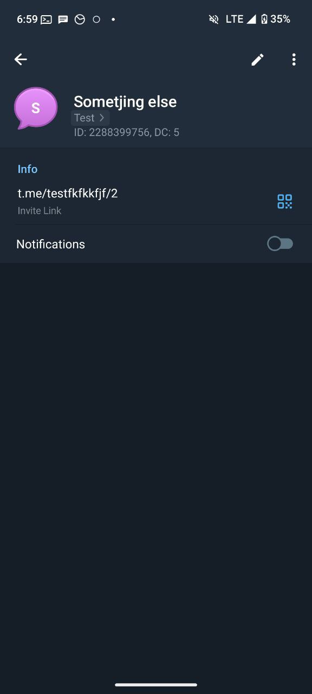
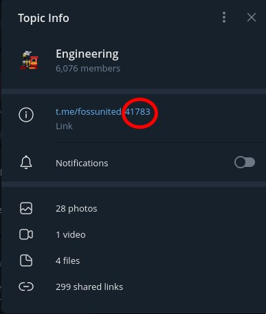
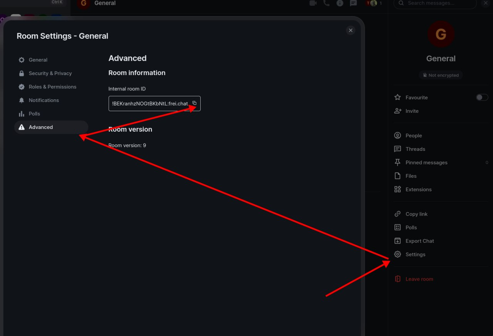

# Instructions for bridging if topic as group is used:

Prerequisites:

- Access to falcon server of FOSS United
- Access to the @fu-bot:tchncs.de account on matrix
- Admin access in the City Chapters Space

## Steps

- Create another public space under the pre-existing City Chapters one


- Create new rooms for each and every topic under the newly created space (ENCRYPTION NEEDS TO BE DISABLED FOR THIS TO WORK)

- Mark important topics (like General, Announcements, Photos) as Suggested

- Open the @fu-bot:tchncs.de account on another element session, join the new space and all the rooms/topics under it


- Get group ID and then topic ID of every topic you want to bridge:
	- If you have Rose bot in the group, use /id to get the group ID
    
	- If you have nekogram on your phone, you can open the group/topic info (by clicking on the topic name), and the Group ID will be shown
    
	- If you go to Topic info (generally by clicking on the name of the topic), the last numbered part of the invite link is the topic ID.
    
- On Matrix, get the room ID of every room under the space that you want to bridge:
	- On Element: Open Settings -> Advanced and then copy the internal room ID
    

- ssh into the falcon server, go to /root/matterbridge and open matterbridge.toml
- At the end of the file, append the following template of data, for every single topic in the group

```
[[gateway]]
enable=true
name="fossunited<CHAPTER><TOPIC>"
[[gateway.inout]]
account="matrix.main"
channel="!<ROOMID>:<HOMESERVER>
[[gateway.inout]]
account="telegram.main"
channel="<GROUP ID WITH -100 PREFIX>/<CHANNEL ID>"
```
NOTE: IF THE TOPIC IS THE ROOT ONE (usually named General), do not add a CHANNEL/TOPIC ID

- Restart Matterbridge by running `docker compose down && docker compose up -d`

And now, the room should be bridged
